# emojis
very important emojis

| image | code |
|:----:|:-----:|
|  |`:abe:` |
| 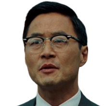 |`:accept-the-mystery:` |
| 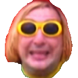 |`:agente-agente:` |
|  |`:alferdez:` |
|  |`:angelici:` |
|  |`:anibal:` |
|  |`:asis:` |
|  |`:atendedor:` |
|  |`:auth0:` |
| 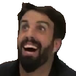 |`:azzaro:` |
|  |`:bakunin:` |
| 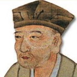 |`:basho:` |
|  |`:boke-off:` |
|  |`:bono:` |
|  |`:capferdez:` |
|  |`:careta:` |
|  |`:carrio:` |
|  |`:caruso-intensifies:` |
|  |`:caruso:` |
| 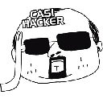 |`:casihacker:` |
|  |`:cavallo:` |
|  |`:cgt:` |
|  |`:chacal:` |
|  |`:chavez:` |
| 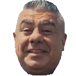 |`:chiqui:` |
|  |`:clojure:` |
|  |`:coco:` |
|  |`:conchita:` |
|  |`:confused:` |
|  |`:corona:` |
|  |`:datadoge:` |
|  |`:david_lunch:` |
| 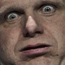 |`:developers:` |
|  |`:diegocry:` |
| 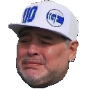 |`:diegocry2:` |
|  |`:diegote:` |
| 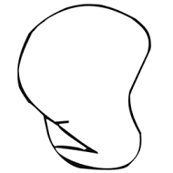 |`:dignidad:` |
|  |`:disappear:` |
|  |`:docker:` |
|  |`:doctorcry:` |
|  |`:doge:` |
|  |`:doomer:` |
|  |`:dujovne:` |
|  |`:dyatlov:` |
|  |`:emacs:` |
| 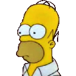 |`:enterado:` |
|  |`:escritorio:` |
|  |`:espert:` |
| 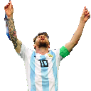 |`:esssto:` |
| 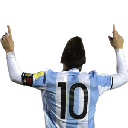 |`:essto:` |
|  |`:estoe:` |
|  |`:estol:` |
|  |`:estom:` |
| 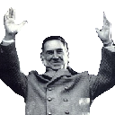 |`:estop:` |
|  |`:evil:` |
|  |`:facepalm:` |
|  |`:facturas:` |
|  |`:fake-news:` |
| 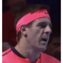 |`:fantasma:` |
|  |`:fantino:` |
|  |`:feinman:` |
|  |`:flinstone:` |
|  |`:fort:` |
|  |`:gallardo:` |
|  |`:gatorei:` |
| 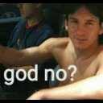 |`:god-no:` |
|  |`:grazie:` |
|  |`:grazie:` |
| 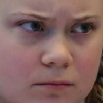 |`:greta:` |
|  |`:hacker:` |
|  |`:happydiego:` |
|  |`:happyguzman:` |
|  |`:haskell:` |
|  |`:hewitt:` |
|  |`:hfacepalm:` |
|  |`:hitler:` |
|  |`:inchequeable:` |
| 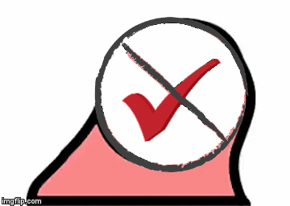 |`:inchequeable_parrot:` |
| 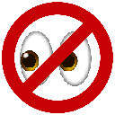 |`:inobservable:` |
| 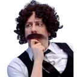 |`:interesante:` |
|  |`:iorio:` |
|  |`:iorio2:` |
|  |`:iseewhatyoudidthere:` |
|  |`:jira:` |
|  |`:jjlopez:` |
|  |`:joe-armstrong:` |
| 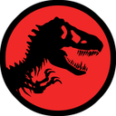 |`:jurassic:` |
|  |`:kafka:` |
|  |`:kfacepalm:` |
| 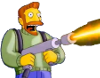 |`:kill-it-with-fire:` |
|  |`:kuka:` |
|  |`:lambda:` |
|  |`:lamolina:` |
| 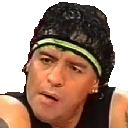 |`:lastima-no:` |
|  |`:lenin:` |
|  |`:macri:` |
| 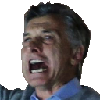 |`:macrisaiyan:` |
|  |`:maestro:` |
|  |`:malafama:` |
|  |`:mao:` |
| 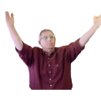 |`:maslaton:` |
| 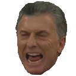 |`:mcrazy:` |
|  |`:menem:` |
| 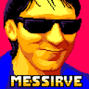 |`:messirve:` |
|  |`:mfacepalm:` |
| 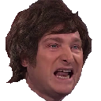 |`:milei:` |
|  |`:mirtha:` |
| 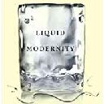 |`:modernidad:` |
|  |`:moyano:` |
|  |`:mussolini:` |
|  |`:niembro:` |
|  |`:okay:` |
|  |`:ono:` |
|  |`:osi:` |
|  |`:pagani:` |
|  |`:paoli:` |
|  |`:parrotpoop:` |
|  |`:partydalio:` |
|  |`:pato:` |
|  |`:pedemonti:` |
| 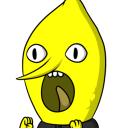 |`:pelito:` |
|  |`:peron:` |
|  |`:pinedo:` |
|  |`:pinto-party:` |
| 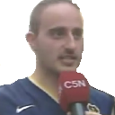 |`:pinto:` |
| 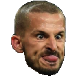 |`:pipa:` |
|  |`:pity:` |
|  |`:ponzi:` |
|  |`:popcorn:` |
|  |`:pr7:` |
| 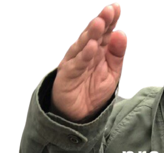 |`:proceda:` |
|  |`:pull-request:` |
|  |`:putin:` |
|  |`:pyme:` |
| 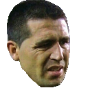 |`:quedicer:` |
|  |`:quepasoahora:` |
| 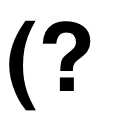 |`:question:` |
|  |`:ramon:` |
|  |`:ramon2:` |
| 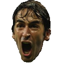 |`:raul:` |
| 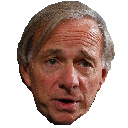 |`:raydalio:` |
|  |`:red-card:` |
|  |`:rico:` |
| 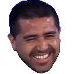 |`:roman:` |
| 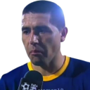 |`:roman2:` |
|  |`:roman3:` |
| 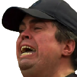 |`:sabalero:` |
| 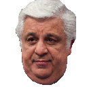 |`:samid:` |
| 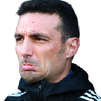 |`:scaloni:` |
| 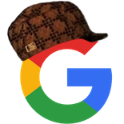 |`:scumbag_google:` |
|  |`:seal-of-approval:` |
|  |`:seal-of-approval2:` |
| 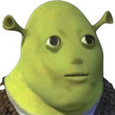 |`:shrok:` |
| 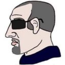 |`:si:` |
| 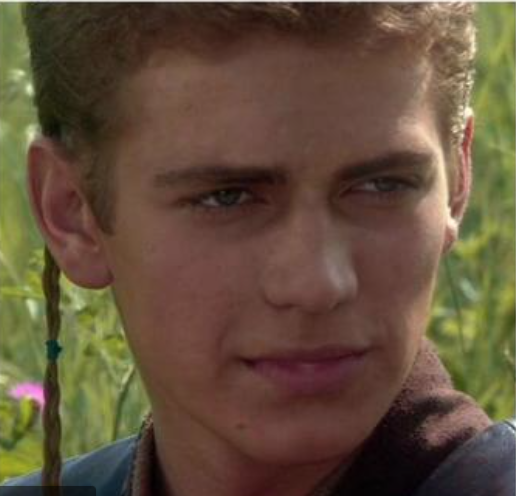 |`:silent-anakin:` |
|  |`:smoke:` |
|  |`:snowden:` |
|  |`:sobrero:` |
| 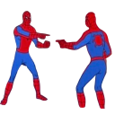 |`:spiderman:` |
|  |`:stalin:` |
| 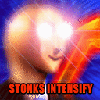 |`:stonks-intensify:` |
|  |`:stonks:` |
| 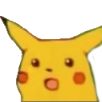 |`:surprised-pikachu:` |
|  |`:takemymoney:` |
| 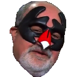 |`:taleb:` |
| 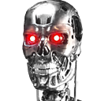 |`:terminator:` |
|  |`:thisisfine:` |
|  |`:til:` |
|  |`:tito:` |
|  |`:toggl:` |
|  |`:tosco:` |
|  |`:travis:` |
|  |`:troll:` |
|  |`:trump:` |
|  |`:very-uncertain:` |
|  |`:viale:` |
|  |`:yellow-card:` |
|  |`:yes:` |
|  |`:yono:` |
|  |`:yosi:` |
|  |`:zappa:` |
|  |`:zappa2:` |
|  |`:zappawhat:` |
|  |`:zappawhat2:` |
|  |`:zoomer:` |

