# emojis
very important emojis

| image | code |
|:----:|:-----:|
| 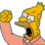 |`:abe:` |
|  |`:angelici:` |
| 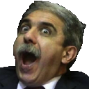 |`:anibal:` |
| 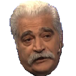 |`:asis:` |
| 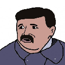 |`:atendedor:` |
|  |`:auth0:` |
|  |`:bakunin:` |
| 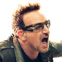 |`:bono:` |
|  |`:careta:` |
|  |`:carrio:` |
|  |`:caruso:` |
| 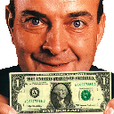 |`:cavallo:` |
|  |`:chacal:` |
| 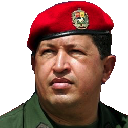 |`:chavez:` |
|  |`:clojure:` |
|  |`:coco:` |
|  |`:conchita:` |
| 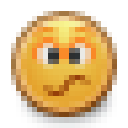 |`:confused:` |
| 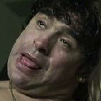 |`:diegote:` |
|  |`:docker:` |
|  |`:dujovne:` |
|  |`:emacs:` |
|  |`:escritorio:` |
|  |`:espert:` |
| 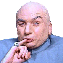 |`:evil:` |
|  |`:facepalm:` |
|  |`:facturas:` |
|  |`:fantino:` |
|  |`:flinstone:` |
|  |`:fort:` |
|  |`:gallardo:` |
|  |`:gatorei:` |
| 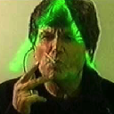 |`:hacker:` |
|  |`:haskell:` |
|  |`:hfacepalm:` |
| 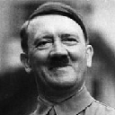 |`:hitler:` |
|  |`:inchequeable:` |
|  |`:iorio:` |
|  |`:iorio2:` |
|  |`:jira:` |
| 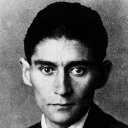 |`:kafka:` |
|  |`:kfacepalm:` |
|  |`:kuka:` |
|  |`:lambda:` |
|  |`:lamolina:` |
|  |`:lenin:` |
|  |`:macri:` |
| 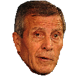 |`:maestro:` |
| 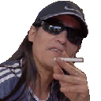 |`:malafama:` |
|  |`:mao:` |
|  |`:menem:` |
|  |`:mfacepalm:` |
|  |`:milei:` |
| 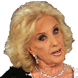 |`:mirtha:` |
|  |`:mussolini:` |
|  |`:niembro:` |
|  |`:okay:` |
| 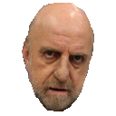 |`:pagani:` |
| 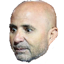 |`:paoli:` |
|  |`:pato:` |
|  |`:peron:` |
|  |`:pinedo:` |
|  |`:pity:` |
|  |`:pr7:` |
| 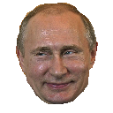 |`:putin:` |
|  |`:pyme:` |
| 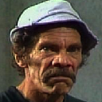 |`:ramon:` |
|  |`:red-card:` |
|  |`:rico:` |
| 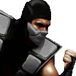 |`:smoke:` |
|  |`:snowden:` |
|  |`:stalin:` |
|  |`:til:` |
|  |`:toggl:` |
| 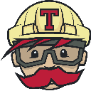 |`:travis:` |
|  |`:troll:` |
|  |`:trump:` |
|  |`:yellow-card:` |
|  |`:yono:` |
| 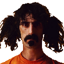 |`:zappa:` |
| 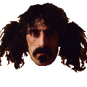 |`:zappa2:` |
|  |`:zappawhat:` |
|  |`:zappawhat2:` |

