# emojis
very important emojis

**:abe:** 

**:angelici:** 

**:asis:** 

**:atendedor:** 

**:auth0:** 

**:bakunin:** 

**:bono:** 

**:careta:** 

**:carrio:** 

**:caruso:** 

**:cavallo:** 

**:chacal:** 

**:chavez:** 

**:clojure:** 

**:coco:** 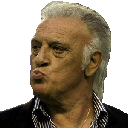

**:conchita:** 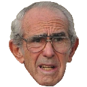

**:diegote:** 

**:docker:** 

**:dujovne:** 

**:emacs:** 

**:escritorio:** 

**:espert:** 

**:evil:** 

**:facepalm:** 

**:facturas:** 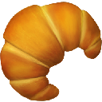

**:flinstone:** 

**:fort:** 

**:gallardo:** 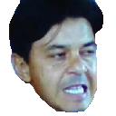

**:gatorei:** 

**:hacker:** 

**:haskell:** 

**:hfacepalm:** 

**:hitler:** 

**:inchequeable:** 

**:iorio:** 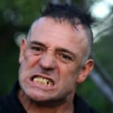

**:iorio2:** 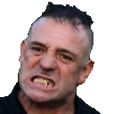

**:jira:** 

**:kafka:** 

**:kfacepalm:** 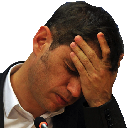

**:kuka:** 

**:lambda:** 

**:lamolina:** 

**:lenin:** 

**:macri:** 

**:mao:** 

**:menem:** 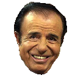

**:mfacepalm:** 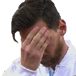

**:milei:** 

**:mirtha:** 

**:mussolini:** 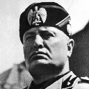

**:niembro:** 

**:okay:** 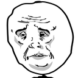

**:pagani:** 

**:paoli:** 

**:pato:** 

**:peron:** 

**:pinedo:** 

**:pity:** 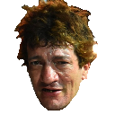

**:putin:** 

**:pyme:** 

**:ramon:** 

**:rico:** 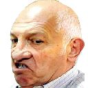

**:smoke:** 

**:snowden:** 

**:stalin:** 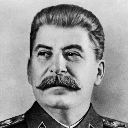

**:til:** 

**:toggl:** 

**:travis:** 

**:troll:** 

**:trump:** 

**:yono:** 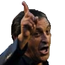

